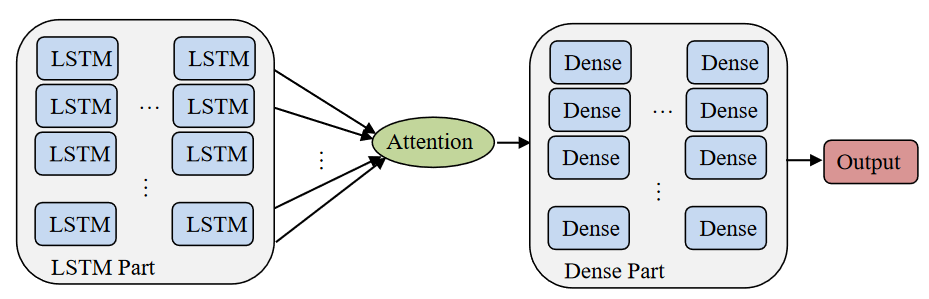

# LSTM Bone Labelling Demo
## About
This code is a demo implementation of my Master's thesis titled "Deep Persistent Bone Labelling for Efficient
Character Animation".

## <mark>Disclaimer!</mark>
This is a demo demonstrating the results of my research. Altering the data or the code might result in unwanted results, if you don't know what are you doing.

## Architecture
The Architecture of the demo consists of two parts, the LSTM part and the Dense part connected by an Attention Layer. The input of the the Network is an animation of a model that is passed to the LSTM and Attention Layers to highlight the latent important features in the data. The Dense Part of the Network then classifies the bones of the model according to the body part they belong to.

*Architecture of Network Used in the Demo*
## Structure
The project has 3 main folders *run*, *train* and *preprocess*.\
**"preprocess/**": contains code that transforms model animations into **.npy** files that can be used by the network.\
**"train/"**: contains the code that trains the network. **"train/main.py"** trains the network on the data in **"../models/training2/"**. **"train/test.py"** is used to test various different parameters of the network reading data from **"test_configs.txt"**\
**"run/"**: has the code that runs the trained Network the user's models.
## Execution
To use the model first you need to preprocess the models using **preprocess/preprocess_models.py**. Here I have provided some examples in **models/**.
### Training
To train the Network you just run **train/main.py**. To change the structure of the network pass the parameter *custom_model* to ***lstm = BoneLSTM()***.
Example:
```
custom_model = [['lstm', '1000'], ['dropout', '0.3'], ['lstm', '1000'], ['dropout', '0.2'], ['attention'], ['dense', '1300', 'relu'], ['dense', '700', 'relu'], ['dense', '300', 'relu'], ['dense', '100', 'relu'], ['dense', '5', 'softmax']])
lstm = BoneLSTM(custom_model=custom_model)
```

<mark>Important</mark>: If you want to run the Network on other 3D models  later you need to pass the argument "2" to the script
```
python train/main.py 2
```
### Running
To run the Network on models you must first train and save it. Then you run 

```
python run/main.py
```
* The results are saved in the model path in the file **results.npy**. 
* To choose your own model to use just change the ***path*** variable.
